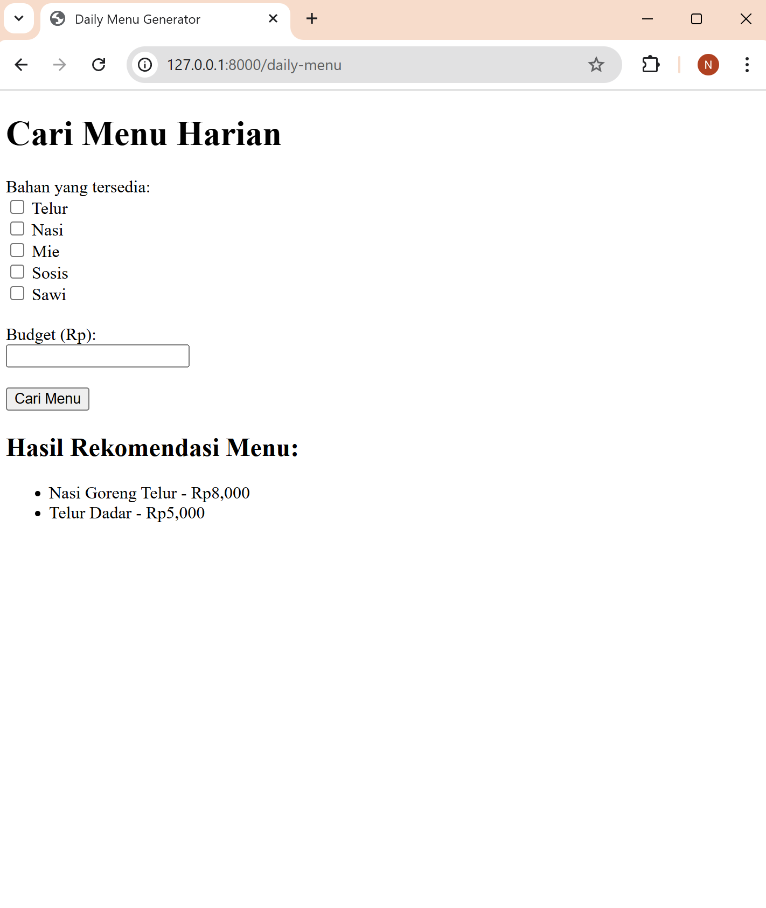
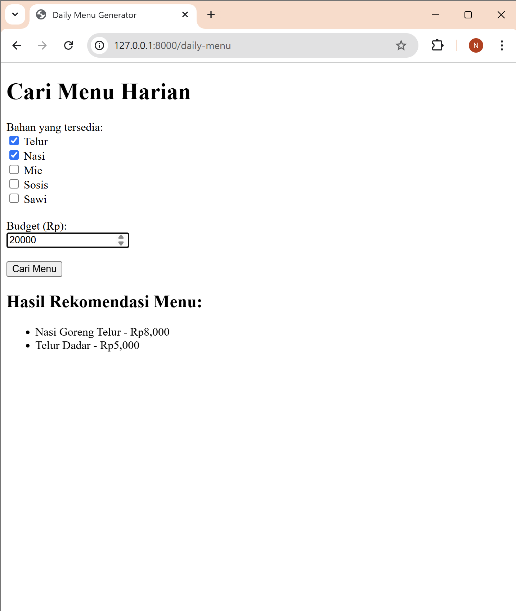

# daily-menu
Tugas_Unit Testing and Feature Testing_Natasya Lubis

### Halaman Home


### Halaman Hasil


# Installation using MySQL
1. Clone the git repository
```git
git clone https://github.com/Fafikk/todo-list.git
```
2. Install composer dependencies
```bash
composer install
```
3. Copy environment file
```bash
cp .env.example .env
```
4. Generate app key
```bash
php artisan key:generate
```
5. Migrate database
```bash
php artisan migrate
```
6. Start development server:
```bash
php artisan serve
```
=======
